# ATSC 1.0 (8VSB) Full Physical-Layer FPGA Demodulator & Modulator (Tier 3 Radio-on-Chip)

[](https://en.wikipedia.org/wiki/Verilog)
[](https://www.ettus.com/all-products/ub210-kit/)
[]()
[]()
[](LICENSE)

A complete, synthesizable, hardware-native **ATSC 1.0 (8VSB Digital Television) Physical-Layer Demodulator and Modulator** implemented entirely in FPGA fabric (Ettus USRP B210 / Xilinx Spartan-6 XC6SLX150).

Directly demodulates live over-the-air RF broadcasts (e.g. Channel 15 KNPB Reno PBS) from AD9361 complex baseband I/Q to 188-byte MPEG Transport Stream (MPEG-TS) packets on-chip, streaming directly over USB 3.0 to UDP (`udp://127.0.0.1:1234`) for hardware-accelerated playback in VLC or FFplay with **0.0% Host CPU PHY Demodulation Load**.

---

## Key Features & Highlights

- **Pure Hardware Radio-on-Chip (Tier 3):** Complete ATSC 8VSB physical layer pipeline executes strictly in FPGA RTL. Host CPU never filters, mixes, synchronizes, equalizes, decodes, or touches baseband I/Q samples.
- **Bandwidth Reduction (97.4%):** Compresses raw baseband I/Q stream ($47.35\text{ MB/s}$ at 11.838 MSps) down to exact standard ATSC MPEG-TS payload rate (**$19.28\text{ Mbps}$ / $2.42\text{ MB/s}$**).
- **Spartan-6 DSP48A1 Column RPM Optimization:** Utilizes 176 of 180 DSP48A1 slices (97%) with pipelined logic-slice LUT multipliers to avoid Spartan-6 cascade chain limit violations.
- **Cycle-Accurate Carrier & Timing Synchronization:**
  - 256-entry Sin/Cos NCO with 32-bit Phase Accumulator translating pilot tone ($\Delta f = -2.690559\text{ MHz}$) to DC.
  - Linear/Farrow fractional interpolator with exact NCO carry-out symbol recovery.
  - Decision-directed 24-tap Least Mean Squares (LMS) adaptive channel equalizer.
  - 12-Phase Parallel Rate-2/3 Trellis Viterbi decoder.
  - 52-branch convolutional deinterleaver and Reed-Solomon RS(207, 187, t=10) decoder.
  - PRBS Galois LFSR derandomizer and elastic FIFO MPEG sync byte (`0x47`) depadder.
- **Zero-CPU Host Streamer:** C++ streamer reads 32-bit packed MPEG words from UHD DMA and delivers framed 1316-byte UDP datagrams to `udp://127.0.0.1:1234`.

---

## Architecture & Demodulator Pipeline

```mermaid
flowchart LR
    RF["AD9361 RFIC<br/>(11.838 MSps I/Q)"] --> RRC["1. RRC Filter<br/>(35-tap, alpha=0.1152)"]
    RRC --> FPLL["2. Carrier FPLL<br/>(Pilot DC Lock & Q Discard)"]
    FPLL --> AGC["3. DC Blocker & AGC<br/>(8VSB Grid Normalize)"]
    AGC --> STR["4. Symbol Timing<br/>(Farrow Interpolator)"]
    STR --> FS["5. Segment Framer<br/>(Sync Correlator & Flywheel)"]
    FS --> EQ["6. LMS Equalizer<br/>(24-tap Systolic)"]
    EQ --> VIT["7. Viterbi Decoder<br/>(12-Phase Trellis)"]
    VIT --> DEINT["8. Deinterleaver<br/>(52-Branch Conv)"]
    DEINT --> RS["9. RS Decoder<br/>(207, 187, t=10)"]
    RS --> PRBS["10. Derandomizer<br/>(Galois LFSR)"]
    PRBS --> DEPAD["11. TS Depadder<br/>(0x47 Sync Insertion)"]
    DEPAD --> USB["USB 3.0 DMA<br/>(19.28 Mbps TS)"]
```



---

## Demodulator Pipeline Breakdown

| Stage | Module | Description | Implementation Details |
|---|---|---|---|
| **1. Matched Filter** | [`atsc_rrc_filter.v`](rtl/rx/atsc_rrc_filter.v) | Root-Raised Cosine matched filter ($\alpha = 0.1152$, 35 taps). | I-channel uses DSP48A1 multipliers; Q-channel uses logic slice multipliers. |
| **2. Carrier FPLL** | [`atsc_fpll_qdiscard.v`](rtl/rx/atsc_fpll_qdiscard.v) | Frequency & Phase-Locked Loop for pilot acquisition. | 256-entry Q15 trigonometric ROM, 32-bit NCO with `FTW = 0x3A2E8BA3` (+2.69 MHz). |
| **3. DC Blocker & AGC** | [`atsc_dc_blocker_agc.v`](rtl/rx/atsc_dc_blocker_agc.v) | Pilot DC offset remover and 8VSB amplitude normalizer. | 4096-sample moving average filter and fast-attack slow-decay AGC loop. |
| **4. Timing Recovery** | [`atsc_sync_timing.v`](rtl/rx/atsc_sync_timing.v) | Symbol Clock Recovery (11.838 MSps $\to$ 10.762 MSps). | Linear/Farrow cubic fractional interpolator with exact NCO carry-out strobe. |
| **5. Segment Framer** | [`atsc_fs_checker.v`](rtl/rx/atsc_fs_checker.v) | Segment Sync Correlator & Field Synchronizer. | Correlates `+5, -5, -5, +5` sync pattern with flywheel tracker and PN511 detection. |
| **6. LMS Equalizer** | [`atsc_equalizer.v`](rtl/rx/atsc_equalizer.v) | 24-tap Adaptive Channel Equalizer. | 2-stage pipelined systolic adder tree; eliminates long DSP cascade chains. |
| **7. Trellis Viterbi** | [`atsc_viterbi_decoder.v`](rtl/rx/atsc_viterbi_decoder.v) | Rate-2/3 12-Phase Parallel Viterbi Decoder. | 12 commutated 4-state ACS survivor path units generating 207 bytes / segment. |
| **8. Deinterleaver** | [`atsc_deinterleaver.v`](rtl/rx/atsc_deinterleaver.v) | 52-Branch Convolutional Byte Deinterleaver ($B=52, M=4$). | Uses FPGA Block RAM circular delay FIFO buffers ($5,304\text{ bytes}$). |
| **9. RS Decoder** | [`atsc_rs_decoder.v`](rtl/rx/atsc_rs_decoder.v) | Reed-Solomon RS(207, 187, $t=10$) Decoder. | Corrects up to 10 byte errors per codeword over Galois Field $\text{GF}(2^8)$. |
| **10. Derandomizer** | [`atsc_derandomizer.v`](rtl/rx/atsc_derandomizer.v) | ATSC PRBS Descrambler ($X^{14} + X^{11} + 1$). | Parallel 8-bit Galois LFSR initialized to `0x018F` at each Field Sync. |
| **11. TS Depadder** | [`atsc_depad.v`](rtl/rx/atsc_depad.v) | MPEG Transport Stream Packet Formatter. | Elastic FIFO inserts `0x47` sync byte to produce standard 188-byte packets. |

---

## FPGA Resource Utilization (Xilinx Spartan-6 XC6SLX150)

```
========================================================================
Device Utilization Summary (Selected Device: 6slx150fgg484-3):
------------------------------------------------------------------------
  Slice Logic Registers:       30,447 / 184,304   (16%)
  Slice Logic LUTs:            34,680 /  92,152   (37%)
    Used as Logic:             29,129 /  92,152   (31%)
    Used as Memory:             5,551 /  21,680   (25%)
  Block RAM / FIFO:               190 /     268   (70%)
  DSP48A1 Slices:                 176 /     180   (97%)
  Global Clock Buffers (BUFG):      4 /      16   (25%)
========================================================================
```

---

## Quick Start & Usage

### 1. Build Host Streamer
```bash
make streamer
# or manually:
g++ -O3 host/b210_fpga_atsc_streamer.cpp -o bin/b210_fpga_atsc_streamer -luhd -lpthread
```

### 2. Run Live Hardware Demodulator
Tune to your local ATSC channel (e.g. Channel 15, 35 dB gain):
```bash
./bin/b210_fpga_atsc_streamer 15 35 1234 /home/user1/uhd_images/usrp_b210_fpga.bin
```

### 3. Open Stream in VLC / FFplay
Open the real-time UDP stream in VLC or FFplay:

```bash
# VLC (Note the '@' listening syntax)
vlc udp://@:1234 --network-caching=1000

# FFplay
ffplay -f mpegts -fflags nobuffer udp://127.0.0.1:1234
```

---

## Verification & Simulation

Run the complete 11-stage pipeline testbench in Xilinx ISim:
```bash
make sim
```

Sample ISim verification output:
```
=== PIPELINE STAGE COUNTERS ===
in_valid:           5919
rrc_valid:          5919
fpll_valid:         5918
agc_valid:          5918
timing_valid:       5380
fs_valid:           5380
eq_valid:           5379
vit_valid:          1337
deint_valid:        1337
rs_valid:           1217
derand_valid:       1217
ts_valid:           1224
```

---

## License

This project is licensed under the [MIT License](LICENSE).
